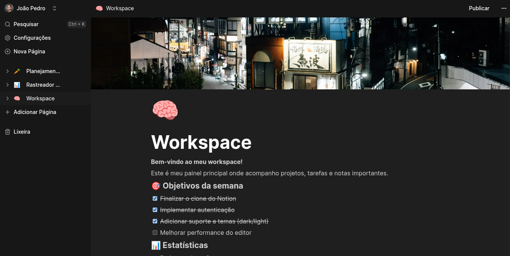
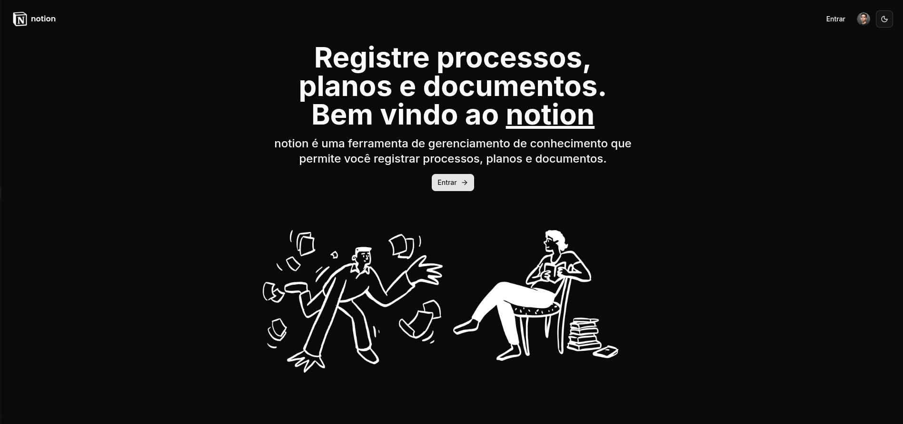
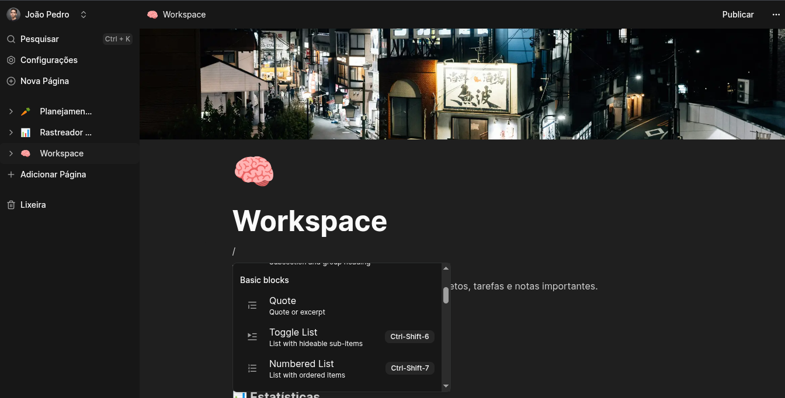
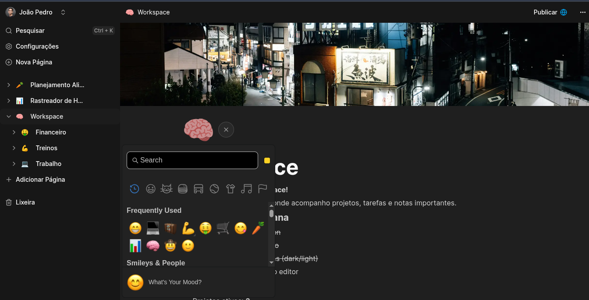
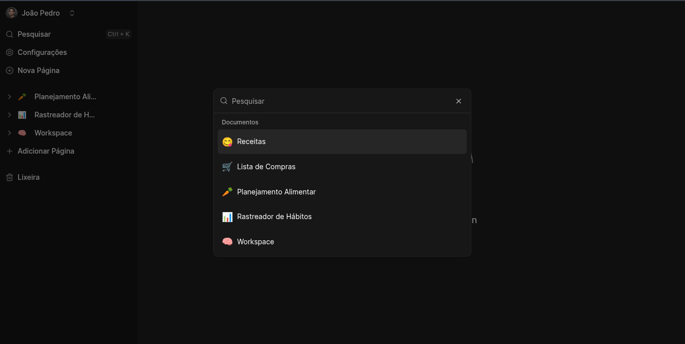
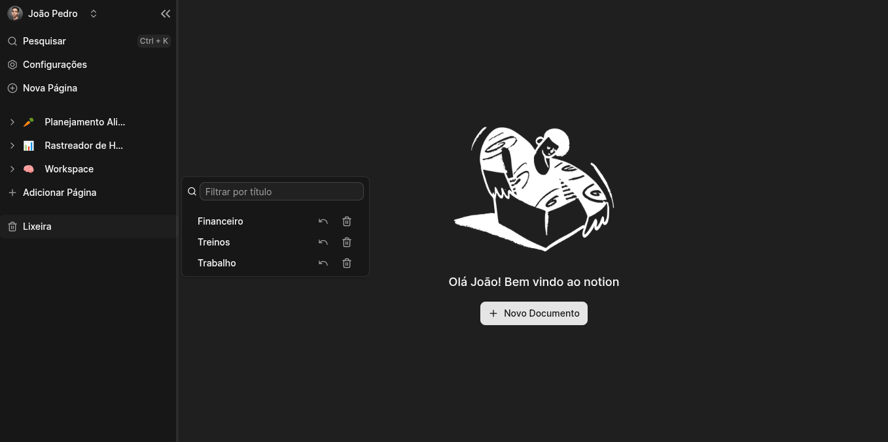

# Notion Clone

Clone funcional do Notion construído como projeto de portfólio. Workspace colaborativo com editor rich-text, documentos aninhados, publicação pública e tema claro/escuro.


<p align="center">
  
</p>

---

## Demonstração

<details>
<summary><strong>Landing Page</strong></summary>
<br>
<p align="center">
  
</p>
</details>

<details>
<summary><strong>Editor Rich-Text com Blocos</strong></summary>
<br>
<p align="center">
  
</p>
</details>

<details>
<summary><strong>Emoji Picker & Ícones</strong></summary>
<br>
<p align="center">
  
</p>
</details>

<details open>
<summary><strong>Busca Global · Lixeira</strong></summary>
<br>
<p align="center">
  
</p>
<p align="center">
  
</p>
</details>

---

## Tech Stack

| Camada | Tecnologia |
|---|---|
| Framework | Next.js 16 (App Router) |
| Linguagem | TypeScript 5 |
| Backend & DB | Convex (serverless realtime) |
| Autenticação | Clerk |
| Editor | BlockNote (rich-text blocks) |
| Upload de arquivos | EdgeStore |
| Estilização | Tailwind CSS 4 + Radix UI + shadcn/ui |
| Estado global | Zustand |
| Formulários | React Hook Form + Zod |
| Tema | next-themes (system/light/dark) |

---

## Funcionalidades

- **Autenticação** — Login/cadastro via Clerk com JWT integrado ao Convex
- **Documentos aninhados** — Criação hierárquica (pai/filho) com sidebar em árvore
- **Editor rich-text** — BlockNote com upload de imagens inline via EdgeStore
- **Metadados do documento** — Título editável, ícone com emoji picker e imagem de capa
- **Publicação pública** — Toggle para publicar documento com link compartilhável
- **Busca global** — Command palette (⌘K) para busca rápida entre documentos
- **Lixeira** — Arquivamento recursivo com restauração ou exclusão permanente
- **Sidebar responsiva** — Redimensionável, retrátil, adaptada para mobile
- **Tema claro/escuro** — Alternância com suporte a preferência do sistema
- **Realtime** — Atualizações em tempo real via Convex

---

## Estrutura do Projeto

```
├── app/
│   ├── (main)/          # Rotas autenticadas (sidebar + editor)
│   ├── (marketing)/     # Landing page pública
│   ├── (public)/        # Preview de documentos publicados
│   └── api/edgestore/   # API route para upload (EdgeStore)
├── components/
│   ├── ui/              # Primitivos shadcn/ui
│   ├── providers/       # Convex, EdgeStore, Theme, Modal
│   ├── modal/           # Settings, Cover Image
│   └── editor.tsx       # Editor BlockNote
├── convex/
│   ├── schema.ts        # Schema do banco (documents)
│   └── documents.ts     # Queries e mutations
├── hooks/               # Custom hooks (search, settings, cover, mobile)
└── lib/                 # Utilitários (cn, edgestore client)
```

---

## Quick Start

### Pré-requisitos

- Node.js 18+
- Conta no [Clerk](https://clerk.com)
- Conta no [Convex](https://convex.dev)
- Conta no [EdgeStore](https://edgestore.dev)

### 1. Clone e instale

```bash
git clone https://github.com/joaopedrodevms/notion-clone.git
cd notion-clone
npm install
```

### 2. Configure as variáveis de ambiente

Crie um arquivo `.env.local` na raiz:

```env
NEXT_PUBLIC_CONVEX_URL=
NEXT_PUBLIC_CLERK_PUBLISHABLE_KEY=
CLERK_SECRET_KEY=
EDGE_STORE_ACCESS_KEY=
EDGE_STORE_SECRET_KEY=
```

Configure também o `CLERK_JWT_ISSUER_DOMAIN` no dashboard do Convex para validação de JWT do Clerk.

### 3. Inicie o Convex

```bash
npx convex dev
```

### 4. Inicie o app

Em outro terminal:

```bash
npm run dev
```

Acesse [http://localhost:3000](http://localhost:3000).

### Scripts disponíveis

| Comando | Descrição |
|---|---|
| `npm run dev` | Dev server (Next.js) |
| `npm run build` | Build de produção |
| `npm run start` | Servidor de produção |
| `npm run lint` | Lint com ESLint |

---

## Deploy

O projeto é compatível com **Vercel** para o frontend. Backend (Convex) e autenticação (Clerk) são gerenciados por seus respectivos dashboards. Configure as mesmas variáveis de ambiente no painel da Vercel.

---

## Licença

MIT License

```
MIT License

Copyright (c) 2025

Permission is hereby granted, free of charge, to any person obtaining a copy
of this software and associated documentation files (the "Software"), to deal
in the Software without restriction, including without limitation the rights
to use, copy, modify, merge, publish, distribute, sublicense, and/or sell
copies of the Software, and to permit persons to whom the Software is
furnished to do so, subject to the following conditions:

The above copyright notice and this permission notice shall be included in all
copies or substantial portions of the Software.

THE SOFTWARE IS PROVIDED "AS IS", WITHOUT WARRANTY OF ANY KIND, EXPRESS OR
IMPLIED, INCLUDING BUT NOT LIMITED TO THE WARRANTIES OF MERCHANTABILITY,
FITNESS FOR A PARTICULAR PURPOSE AND NONINFRINGEMENT. IN NO EVENT SHALL THE
AUTHORS OR COPYRIGHT HOLDERS BE LIABLE FOR ANY CLAIM, DAMAGES OR OTHER
LIABILITY, WHETHER IN AN ACTION OF CONTRACT, TORT OR OTHERWISE, ARISING FROM,
OUT OF OR IN CONNECTION WITH THE SOFTWARE OR THE USE OR OTHER DEALINGS IN THE
SOFTWARE.
```
